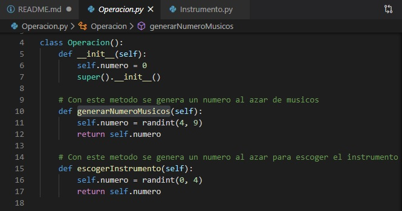
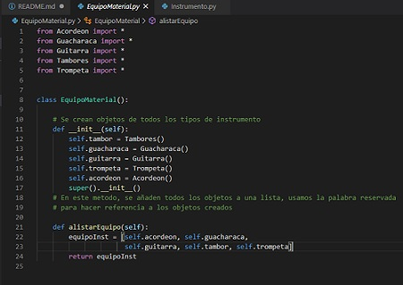
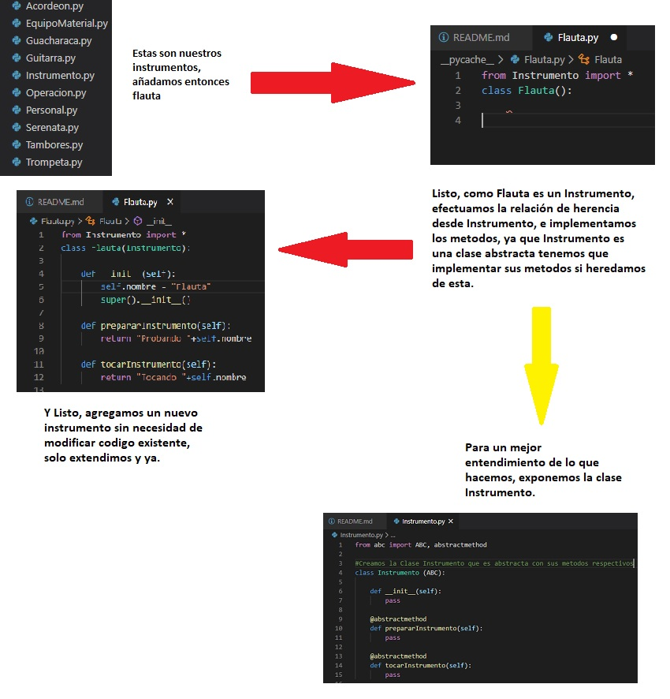
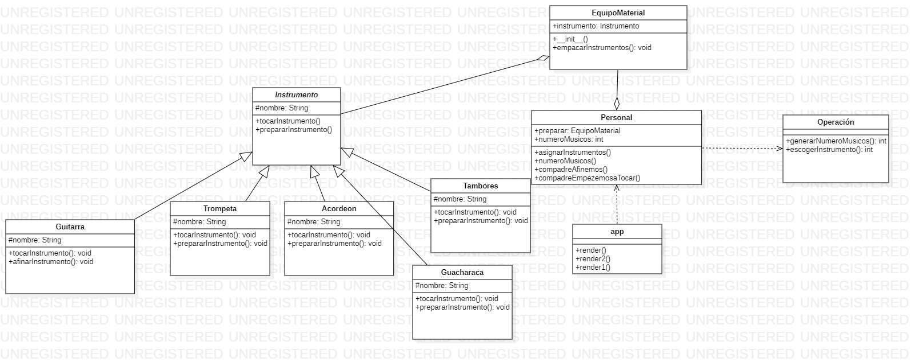

# Explicación Ejercicio Banda :star2:

Este ejercicio fue realizado por

> Julian Esteban Mendoza Wilches  2018202005

>Reinaldo Espinel Torres 20182020015

**Modelos de programación I** , Universidad Distrital Francisco José de Caldas.

**Docente:** Alejandro Paolo Daza

## ¿En que consiste?

Nosotros contamos con nueve amigos, los cuales son musicos, incluidos  nostros seriamos diez, tenemos una banda la cual da serenatas. Nosotros trabajamos en eso, en algun momento alguien nos va a llamar en el futuro para dar una serenata, pero nosotros no sabemos con cuantos de nuestros amigos contaremos para ese dia cualquiera. Nosotros contamos con 5 instrumentos en total, sin embargo si queremos añadir un nuevo instrumento a nuestra banda lo tendriamos que hacer sin ningun problema.

Nuestros amigos y nosotros tocaran con los instrumentos que existan en el momento, por lo que los instrumentos se podran repetir entre nuestro amigos. Por ejemplo: Para el dia en el que nos toque dar la serenata somos 7 en total, y tenemos 5 instrumentos disponibles (guacharaca, trompeta, guitarra, flauta, tambores), como hay mas musicos que personas, se tendra que repetir algun instrumento para que todos tengamos un instrumento al momento de tocar

### :notes: :notes: :notes: :notes: :notes: :notes: :notes: :notes: 

## Recursos :evergreen_tree:

El back end de la app esta realizado en python, se hace uso del microframework **flask** para llevar nuestro proyecto a pagina web. El front end del proyecto se hace en **html**.

## Uso de Principios de diseño :dart:
Para realizar un mejor software y evitar algunos problemas de rigidez, fragilidad, viscocidad etc, se implementan algunos principios de diseño **SOLID**. Se implementan los siguientes principios:

- **SRP** (Single Responsability Principle)
- **OCP** (Open Closed Principle)
- **KISS** (Keep it simple and stupid)
- **ISP** (Interface Segregation Principle)

Vamos a explicar el porque se estan cumpliendo estos principios:

### SRP :mag:

Cumplimos el principio de responsabilidad unica ya que creamos clases las cuales solo tienen una razón para cambiar, por ejemplo, las clases como los instrumentos (guacharaca, guitarra) solo cambian por una razón, la de sus metodos probar guitarra y tocar guitarra, todo es relacionado al instrumento, esta clase no contiene cosas que no sean relacionadas.

Por otro lado, la clase Operación, esta clase se usa para extraer un numero al azar de instrumento y el numero de musicos que participan en la serenata, esta clase solo se concentra en sacar numeros al azar, si quisieramos cambiar algo de esta clase va a ser en razon de por ejemplo, modificar el rango de numeros d elos cuales va a sacar el numero al azar.

Tambien la clase EquipoMaterial , esta solo se encarga de hacer el equipo de instrumentos que va a ser usado el dia de la serenata, creando asi una lista y agregando cada instrumento a esta. Si alguna vez queremos o necesitamos cambiarla, esta cambia solo por esta razón, la de agregar nuevos instrumentos o quitar insyrumentos ya existentes, al hacerlo en python, no nos preocupamos por definir el taaño del arreglo, ya que usamos una lista, y esta es dinamica.

### OCP :boom:

En caso de que queramos agregar un nuevo instrumento, agregamos nuevo codigo, no modificamos, tal cual lo dice el principio:
> Este principio nos dice que una entidad de software debería estar abierta a extensión pero cerrada a modificación. 

Si por ejemplo, queremos agregar el instrumento Flauta lo unico que tenemos que hacer es crear la clase flauta, extenderla de la clase instrumento y listo, ya tendremos un nuevo instrumento.

 

### KISS :sunny:
Tratamos de mantener todo muy simple, a nuestra percepción sin tanta complejidad, por ejemplo, usamos listas para no matarnos la cabeza pensando el rango de un for y aprovechamos las funciones que tienen esta listas como "apend" , "insert" etc, usamos la funcion len, la cual nos permite conocer el numero de objetos que tiene la lista, tratamos de mantener todo separado como anteriormente se describio usando los principios **SRP** Y **OCP** por si se quiere hacer una modificación en un futuro para tener menos problemas. Ademas el lenguaje pyhton, nos ayudo bastante, ya que nos hemos dado cuenta de su gran versatilidad, el cual nos permitio desarrollar de mejor manera el ejercicio, si bien, lo importante es saber programar, independientemente del lenguaje que usemos, sin embargo usamos el que mas nos convenga para solucionar el problema inicial planteado y en este caso, python un lenguaje totalmente orientado a objetos, nos ayudo bastante.

### ISP :art:

Inicialmente en el diagrama de clases se planetaron dos interfaces, las cuales cada una tenia uel metodo **afinarInstrumento** y **tocarInstrumento**, sin embargo en pyhton no tenemos la opcion de hacer interfaces, pero si de hacer clases abstractas, por lo que creamos la clase abtracta Instrumento y creamos dos metodos tambien abstractos, aca sabemos que cualquier instrumento va a usar los metodos **prepararInstrumento()** y **tocarInstrumento()**, entonces, cumplimos el principio porque no obligamos a clases a a implementar interfaces que no necesiten, ya que en este caso si se usan.

## Diagrama de Clases

